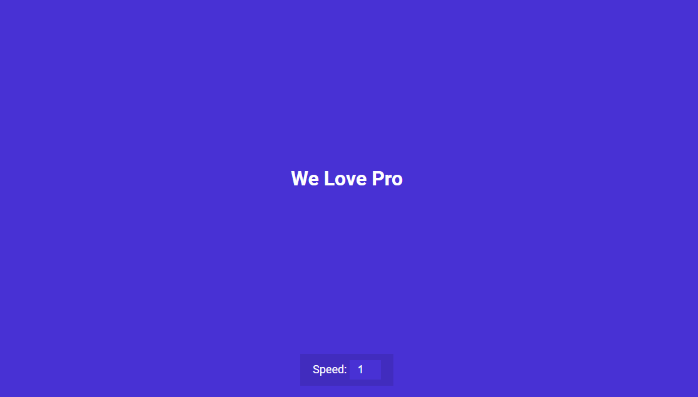

# Auto Typing Effect



## 🦉 Main information

Auto typing effect built with Html, CSS and Vanilla JavaScript.

The project goal:

- set up functionality with Vanilla JS
- add a speed control to go faster or slower


## 🦊 Useful links 


### slice() method

```
https://developer.mozilla.org/en-US/docs/Web/JavaScript/Reference/Global_Objects/String/slice
```


### setTimeout() method

```
https://developer.mozilla.org/en-US/docs/Web/API/setTimeout
```


## ⚡ Built With
[HTML5](https://www.w3schools.com/html/) / [CSS3](https://www.w3schools.com/css/) / [JavaScript](https://www.w3schools.com/js/)